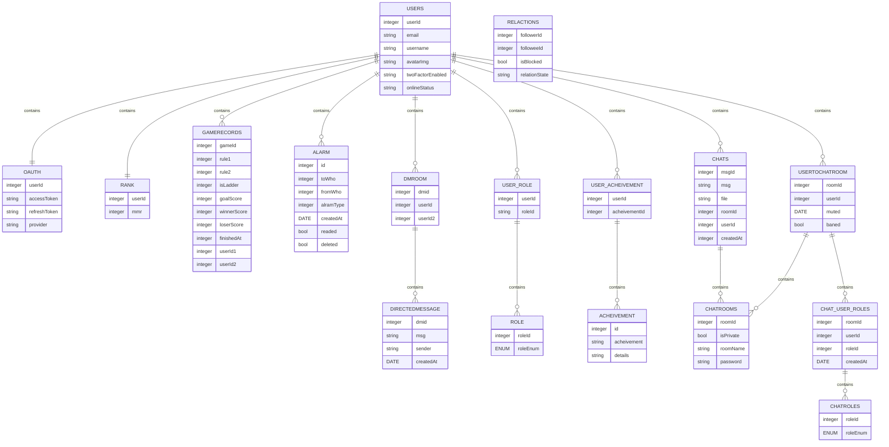

```mermaid
erDiagram
    USERS ||--|| OAUTH : contains
    USERS ||--|| RANK : contains
    USERS ||--o{ GAMERECORDS : contains
    USERS ||--o{ ALARM : contains
    USERS ||--o{ DMROOM : contains
    USERS ||--o{ USER_ROLE : contains
    USERS ||--o{ USER_ACHEIVEMENT : contains
    USERS ||--o{ CHATS : contains
    USERS ||--o{ USERTOCHATROOM : contains
    
    DMROOM ||--o{ DIRECTEDMESSAGE : contains
    
    USER_ROLE ||--o{ ROLE : contains
    
    USER_ACHEIVEMENT ||--o{ ACHEIVEMENT : contains
    
    CHATS ||--o{ CHATROOMS : contains
    
    USERTOCHATROOM ||--o{ CHATROOMS : contains
    USERTOCHATROOM ||--o{ CHAT_USER_ROLES : contains
    CHAT_USER_ROLES ||--o{ CHATROLES : contains

    CHATS {
        integer msgId
        string msg
        string file
        integer roomId
        integer userId
        integer createdAt
    }
    OAUTH {
        integer userId
        string accessToken
        string refreshToken
        string provider
    }
    RANK {
        integer userId
        integer mmr
    }
    USERS {
        integer userId
        string email
        string username
        string avatarImg
        string twoFactorEnabled
        string onlineStatus
    }
    GAMERECORDS {
        integer gameId
        integer rule1
        integer rule2
        integer isLadder
        integer goalScore
        integer winnerScore
        integer loserScore
        integer finishedAt
        integer userId1
        integer userId2
    }
    ALARM {
        integer id
        integer toWho
        integer fromWho
        integer alramType
        DATE createdAt
        bool readed
        bool deleted
    }
    USERTOCHATROOM {
        integer roomId
        integer userId
        DATE muted
        bool baned
    }
    CHATROOMS {
        integer roomId
        bool isPrivate
        string roomName
        string password
    }
    RELACTIONS {
        integer followerId
        integer followeeId
        bool isBlocked
        string relationState
    }
    DMROOM {
        integer dmid
        integer userId
        integer userId2
    }
    DIRECTEDMESSAGE {
        integer dmid
        string msg
        string sender
        DATE createdAt
    }
    CHATROLES {
        integer roleId
        ENUM roleEnum
    }
    CHAT_USER_ROLES {
        integer roomId
        integer userId
        integer roleId
        DATE createdAt
    }
    USER_ROLE {
        integer userId
        string roleId
    }
    ROLE {
        integer roleId
        ENUM roleEnum
    }
    ACHEIVEMENT {
        integer id
        string acheivement
        string details
    }
    USER_ACHEIVEMENT {
        integer userId
        integer acheivementId
    }

```
